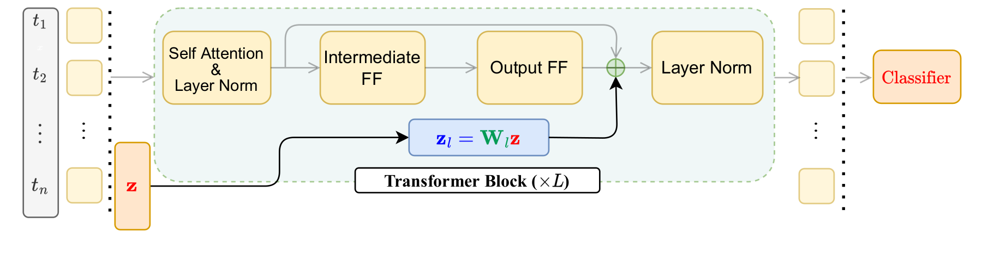

## Jointly Reparametrized Multi-Layer Adaptation for Efficient and Private Tuning

This repository contains the code for our ACL 2023 Paper --- Jointly Reparametrized Multi-Layer Adaptation for Efficient and Private Tuning ([https://arxiv.org/abs/2305.19264](https://arxiv.org/abs/2305.19264)).

### Citation

```bibtex
@inproceedings{gupta2023jointly,
  title={Jointly Reparametrized Multi-Layer Adaptation for Efficient and Private Tuning},
  author={Gupta, Umang and Galstyan, Aram and Ver Steeg, Greg},
  booktitle={Findings of the Association for Computational Linguistics: ACL 2023},
  year={2023}
}
```





### Dependencies
- This code is test with Python 3.10 but may work with earlier versions.
- See `requirements.txt` to setup the environment and get all the python package dependencies.  

### Code
All the parameter efficient finetuning methods that we implemented and tested are in `src/models.py`. `src/mem_optimized_slash` implements a custom layer that performs forward and backward propogration by generating projection matrices on the fly. It is not fully tested. 


### Reproducing Results
See [commands.md](shell/commands.md) to run experiments and reproduce tables mentioned in the paper. This should be a good start to understand how to run the commands and which python to check to understand the code. The `shell` folder contain commands for different methods and tasks with most of the hyperparameters explicitly passed.


- All the efficient finetuning methods are in `src/models.py` and excute using `run_*.py` files in `src/` folder.
- We use `src/compute_noise.py` to find the correct noise parameters for DP training.

